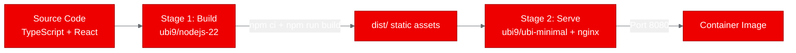
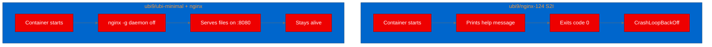

# Image Review -- v1

## Scores

| Dimension | Weight | Score | Weighted | Notes |
|---|---|---|---|---|
| Placement rationale | 2x | 5 | 10 | The single Mermaid diagram (deploy pipeline) is well-placed and aids comprehension. But only 1 visual in a ~1400-word post leaves large text-only stretches with no visual anchors. |
| Prompt specificity | 2x | 2 | 4 | No image placeholders exist anywhere in the draft. There are zero generation prompts to evaluate. The Mermaid diagram is inline code, not a generated image. |
| Brand compliance | 2x | 7 | 14 | The Mermaid `%%{init}%%` block correctly references `#EE0000`, `#A30000`, `#6A6E73`, `#F0F0F0`, and `#0066CC`. Good use of the Red Hat palette. No other images exist to evaluate. |
| Aspect ratio & sizing | 1x | 2 | 2 | No aspect ratios specified. The Mermaid diagram gets a rubric pass, but the draft needs image placeholders with proper ratio specs for the missing visuals. |
| Alt text quality | 1x | 2 | 2 | No alt text on any visual. The Mermaid diagram has no caption or accessible description. |
| Image count | 1x | 3 | 3 | 1 visual total. A post of this length and complexity should have 3-5 visuals. Multiple clear opportunities are missed (see below). |
| **Total** | | | **35 / 90** | |

**Normalized Score: 3.9 / 10**

## Per-Image Feedback

### Mermaid Diagram: Deploy Pipeline (lines 93-100)

- **Type:** `graph LR` flowchart
- **Placement:** Good. Directly follows the `oc` build commands, visually summarizing the deploy flow before the PoC test section.
- **Diagram clarity:** Readable and accurate. The four nodes (BuildConfig -> Image -> Deployment -> Service -> Probe) correctly reflect the deployment steps described in the text.
- **Diagram type:** Flowchart is the right choice for a linear pipeline.
- **Brand theming:** `%%{init}%%` block is present with Red Hat brand variables. Uses `primaryColor: '#EE0000'`, `primaryBorderColor: '#A30000'`, `lineColor: '#6A6E73'`, `secondaryColor: '#F0F0F0'`, `tertiaryColor: '#0066CC'`. Correct.
- **Suggestion:** Add `<br/>` sizing annotations to the Deployment node (e.g., `256Mi RAM`) -- already done. No changes needed to this diagram.

## Missing Image Opportunities

The draft has significant gaps in visual communication. The following images should be added:

### 1. Hero Image (before the first section)

Add an image placeholder at the top of the post. Suggested prompt:

```
<!-- IMAGE: hero
prompt: "Flat-style technical illustration showing a React application logo connected to an OpenShift container platform. A browser window on the left shows a light novel reading interface. On the right, a Red Hat OpenShift cluster with container pods. Connected by arrows showing deployment flow. Clean white background, Red Hat brand colors: primary red #EE0000, dark neutral #151515, light gray #F0F0F0, accent blue #0066CC. No text overlays."
alt: "Diagram showing Light Novel Studio, a React SPA, being deployed from a browser application to an OpenShift container cluster"
aspect: 16:9
-->
```

### 2. Multi-Stage Build Diagram (in "Building the UBI Dockerfile" section)

Convert the two-stage build concept into a Mermaid diagram or image placeholder. This is diagrammable content and would break up the longest text-only stretch in the post. Suggested Mermaid:



Place this between the Dockerfile code block and the "Why not ubi9/nginx-124?" subsection.

### 3. S2I vs. Direct Install Comparison (in "Why not ubi9/nginx-124?" section)

A small inline diagram or image showing the S2I image behavior (prints help, exits 0) vs. direct nginx install (stays alive, serves files) would make the key lesson more visually immediate. Suggested Mermaid:



### 4. Application Screenshot or Mockup (in "What is Light Novel Studio?" section)

A screenshot or placeholder showing the Light Novel Studio UI would help readers understand what the application does. This is especially useful since the app is a visual writing tool.

```
<!-- IMAGE: inline
prompt: "Screenshot-style mockup of a web application for writing light novels. Left sidebar shows a list of novel projects. Main panel shows a novel generation workflow with sections for Concept, Worldbuilding, Characters, Plot Outline, and Chapters. Clean modern UI with white background, subtle gray borders #6A6E73, and red #EE0000 accent buttons. Browser chrome visible at top."
alt: "Light Novel Studio interface showing the novel generation workflow with concept input, worldbuilding, character profiles, and chapter generation panels"
aspect: 4:3
-->
```

## Summary

The draft has exactly one visual -- a well-constructed Mermaid deploy pipeline diagram with correct Red Hat branding. That diagram is good. The problem is that it's the only visual in a 1400-word technical post that has at least four natural image insertion points.

**Key issues to fix in v2:**
1. Add a hero image placeholder with a detailed generation prompt, 16:9 aspect ratio, and descriptive alt text
2. Add a multi-stage build Mermaid diagram in the Dockerfile section (diagrammable content should use Mermaid per rubric)
3. Add an S2I vs. direct install comparison diagram
4. Consider an application screenshot/mockup in the intro section
5. Every image placeholder must include: generation prompt with brand hex codes, alt text, and aspect ratio
6. The existing Mermaid diagram needs an accessible caption or surrounding text that serves as alt text
