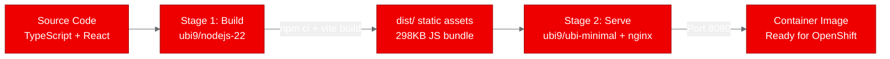
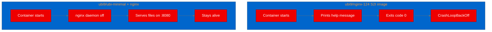

## Deploying an AI-powered React SPA on OpenShift with UBI images

Modern AI applications don't always need a GPU cluster. Sometimes the "AI" part runs entirely in the user's browser, calling external large language model (LLM) application programming interface (API) endpoints directly. But even these lightweight frontends need reliable, secure container hosting. We took Light Novel Studio, a React single-page application (SPA) that uses Gemini, Claude, and OpenAI for automated novel writing, and deployed it to [Red Hat OpenShift](https://www.redhat.com/en/technologies/cloud-computing/openshift) using Red Hat Universal Base Images. Here's what we learned.

If you're deploying your own AI-powered frontend, [get started with Red Hat OpenShift](https://developers.redhat.com/products/openshift/overview) to take advantage of the same UBI-based workflow we demonstrate here.

--------------------
**[Image Placeholder 1: Hero image]**

**Placement rationale**: Sets visual context for the post, showing the connection between a frontend SPA and OpenShift container deployment.
**Image generation prompt**: Flat-style technical illustration showing a React application logo connected to an OpenShift container platform. A browser window on the left shows a light novel reading interface with Asian text. On the right, a Red Hat OpenShift cluster with container pods. Connected by arrows showing deployment flow. Clean white background, Red Hat brand colors: primary red #EE0000, dark neutral #151515, light gray #F0F0F0, accent blue #0066CC. No text overlays. 16:9 aspect ratio.
**Alt text**: Diagram showing Light Novel Studio, a React single-page application, being deployed from a browser application to an OpenShift container cluster

--------------------

## What is Light Novel Studio?

Light Novel Studio is an open-source React application built with Vite 6 and TypeScript. Users type a one-line concept ("a detective who solves crimes using time travel"), and the app orchestrates multiple AI calls to generate a complete novel: worldbuilding, character profiles, plot outlines, and full chapter text. It supports Google Gemini, Anthropic Claude, OpenAI, and any OpenAI-compatible endpoint like DeepSeek or Ollama.

--------------------
**[Image Placeholder 2: Application screenshot]**

**Placement rationale**: Shows readers what the application looks like, making the project tangible before diving into deployment details.
**Image generation prompt**: Screenshot-style mockup of a web application for writing light novels. Left sidebar shows a list of novel projects. Main panel shows a novel generation workflow with sections for Concept, Worldbuilding, Characters, Plot Outline, and Chapters. Clean modern UI with white background, subtle gray borders #6A6E73, and red #EE0000 accent buttons. Browser chrome visible at top. 4:3 aspect ratio.
**Alt text**: Light Novel Studio interface showing the novel generation workflow with concept input, worldbuilding, character profiles, and chapter generation panels

--------------------

The interesting architectural choice: all AI calls happen client-side. The app stores everything in browser localStorage. There's no backend server, no database, no API gateway. This makes it trivially stateless from a hosting perspective, but it also means the deployment challenge is purely about serving static files correctly.

## The containerization challenge

Serving a React SPA sounds simple: build the assets, put them behind nginx, done. On OpenShift, 3 things complicate this:

1. **[UBI base images.](https://www.redhat.com/en/blog/introducing-red-hat-universal-base-image)** OpenShift environments typically require Red Hat Universal Base Images for security and support compliance. You can't just pull a generic nginx Alpine image.

2. **Non-root execution.** OpenShift assigns random user IDs (UIDs) at runtime. Your container can't write to directories owned by root, and it can't bind to port 80.

3. **SPA routing.** Single-page apps need a catch-all rule: any URL that doesn't match a static file should return the index page so client-side routing can handle it.

## Building the UBI Dockerfile

We used a two-stage build. The first stage compiles the TypeScript and bundles the React app. The second stage serves the result with nginx.



The multi-stage build diagram above shows how source code flows through the Node.js build stage into static assets, then into a minimal nginx serving container.

```dockerfile
# Stage 1: Build
FROM registry.access.redhat.com/ubi9/nodejs-22 AS builder
WORKDIR /opt/app-root/src
COPY package.json package-lock.json ./
RUN npm ci
COPY . .
RUN npm run build

# Stage 2: Serve
FROM registry.access.redhat.com/ubi9/ubi-minimal
RUN microdnf install -y nginx && microdnf clean all
RUN mkdir -p /tmp/nginx /var/log/nginx /var/lib/nginx/tmp && \
    chown -R 1001:0 /tmp/nginx /var/log/nginx /var/lib/nginx /var/run && \
    chmod -R g=u /tmp/nginx /var/log/nginx /var/lib/nginx /var/run
COPY --from=builder /opt/app-root/src/dist /usr/share/nginx/html
COPY nginx.conf /etc/nginx/nginx.conf
RUN chgrp -R 0 /usr/share/nginx/html && chmod -R g=u /usr/share/nginx/html
EXPOSE 8080
USER 1001
CMD ["nginx", "-g", "daemon off;"]
```

### Why not the UBI nginx S2I image?

Our first attempts used the official UBI nginx-124 image from the Red Hat container catalog. It didn't work for this use case. The nginx-124 image is a Source-to-Image (S2I) container: when you run it without the S2I workflow, it prints a help message and exits with code 0. This causes a CrashLoopBackOff in Kubernetes because the container "succeeds" immediately instead of staying alive.



The comparison above illustrates the key difference: the S2I image exits immediately without the S2I build pipeline, while installing nginx directly on ubi-minimal gives full control over startup behavior.

We switched to ubi9/ubi-minimal with nginx installed via microdnf. This gives us full control over the nginx configuration and startup command without fighting the S2I machinery.

### The nginx configuration

The key nginx settings for [OpenShift compatibility](https://docs.openshift.com/container-platform/latest/openshift_images/create-images.html):

```nginx
pid /tmp/nginx/nginx.pid;
error_log /tmp/nginx/error.log;

server {
    listen 8080;
    root /usr/share/nginx/html;

    location / {
        try_files $uri $uri/ /index.html;
    }

    location /health {
        return 200 '{"status":"ok"}';
    }
}
```

Every writable path (PID file, logs, temp directories) goes under the tmp directory. The try_files directive handles SPA routing. Port 8080 avoids the privileged port restriction.

## Deploying to OpenShift

We built the image on-cluster using an [OpenShift BuildConfig](https://docs.openshift.com/container-platform/latest/cicd/builds/understanding-buildconfigs.html) with binary input:

```bash
oc new-build --name=lightnovel-studio --binary --strategy=docker \
  --to-docker --to="quay.io/aicatalyst/lightnovel-studio:latest" \
  --push-secret=autopoc-registry-push

oc start-build lightnovel-studio --from-dir=. --follow --wait
```

The deployment manifest is straightforward: a single-replica Deployment with 256Mi memory and a ClusterIP Service on port 8080. The readiness probe hits the health endpoint.


The deployment pipeline diagram shows how the BuildConfig produces the container image, which feeds into a Kubernetes Deployment exposed through a ClusterIP Service.

Ready to deploy your own frontend on OpenShift? Check out the [Red Hat Developer learning path for OpenShift](https://developers.redhat.com/learn/openshift) for step-by-step guidance.

## Running PoC tests

We validated 4 scenarios using a Python test script with the standard library:

| Test | What it checks | Result |
|------|---------------|--------|
| Health check | Health endpoint returns JSON with status "ok" | Pass (0.02s) |
| Index page | Root path returns HTML with React root div | Pass (0.01s) |
| Static assets | HTML references Vite-built JS bundle | Pass (0.01s) |
| SPA routing | Arbitrary path falls back to index page | Pass (0.01s) |

All 4 passed on the first attempt, with sub-20ms response times.

## Lessons learned

**The S2I nginx image isn't designed for direct multi-stage builds.** If you need a custom nginx configuration, install nginx directly on ubi9/ubi-minimal. The S2I image is designed for the oc new-app workflow, not for multi-stage Dockerfile builds.

**Every writable path must be under the tmp directory.** OpenShift's random UID assignment means your process can only write to directories with group 0 permissions. Putting the nginx PID file, logs, and temp directories under /tmp/ with appropriate group permissions is the cleanest approach.

**Client-side AI apps are easy to deploy, hard to govern.** Light Novel Studio's architecture pushes all complexity to the browser. This makes the container trivially simple, but it also means there's no server-side control over API key management, usage limits, or model selection. For enterprise deployments, you'd want a backend proxy that mediates LLM API access through [Red Hat OpenShift AI](https://www.redhat.com/en/technologies/cloud-computing/openshift/openshift-ai).

## Try it yourself

The full source, Dockerfile, Kubernetes manifests, and test scripts are available at:

- **Fork:** [github.com/aicatalyst-team/lightnovel-studio](https://github.com/aicatalyst-team/lightnovel-studio)
- **Image:** quay.io/aicatalyst/lightnovel-studio:latest
- **Artifacts:** [autopoc-artifacts branch](https://github.com/aicatalyst-team/lightnovel-studio/tree/autopoc-artifacts)

To deploy on your own cluster:

```bash
kubectl create namespace poc-lightnovel-studio
kubectl apply -f kubernetes/ -n poc-lightnovel-studio
```

The UBI nginx pattern demonstrated here works for any Vite, React, Vue, or Angular SPA that builds to static files. Swap the build stage for your framework, keep the nginx stage as-is, and you have a production-ready OpenShift deployment.

Explore more ways to deploy AI workloads on [Red Hat OpenShift AI](https://www.redhat.com/en/technologies/cloud-computing/openshift/openshift-ai) and visit the [Red Hat Developer portal](https://developers.redhat.com/) for tutorials, tools, and community resources.
