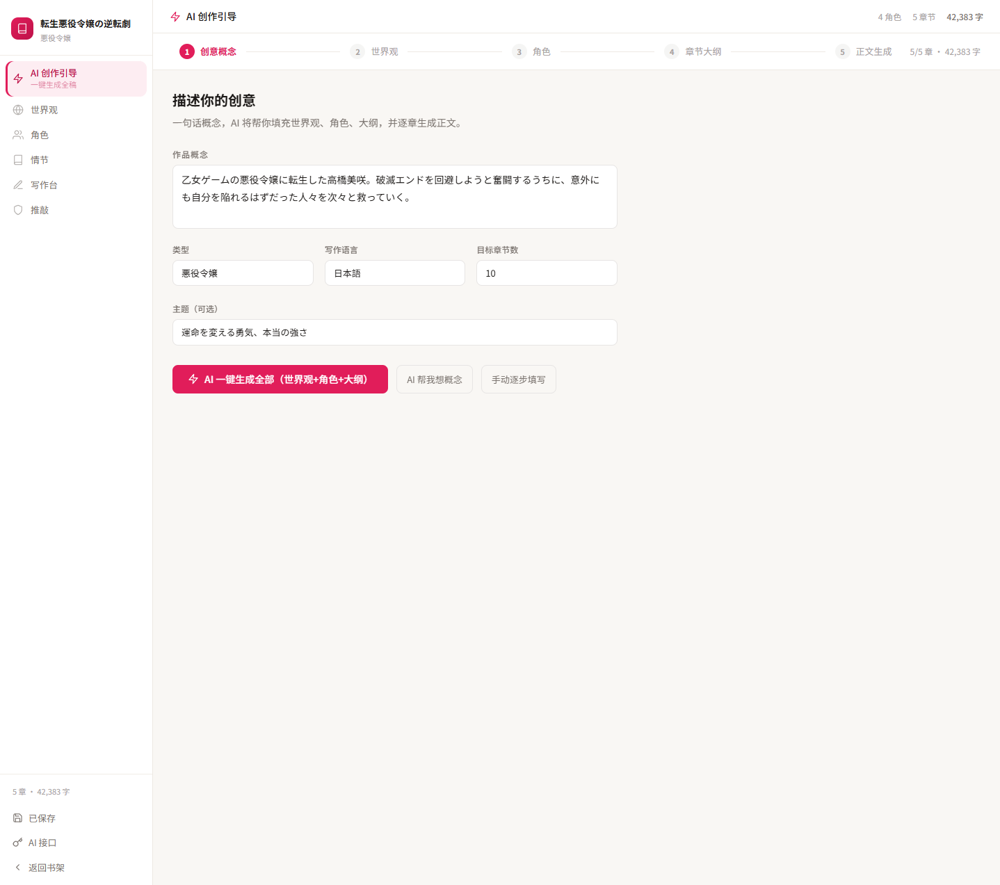
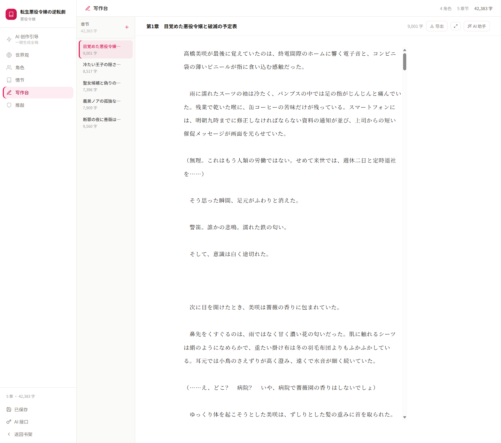
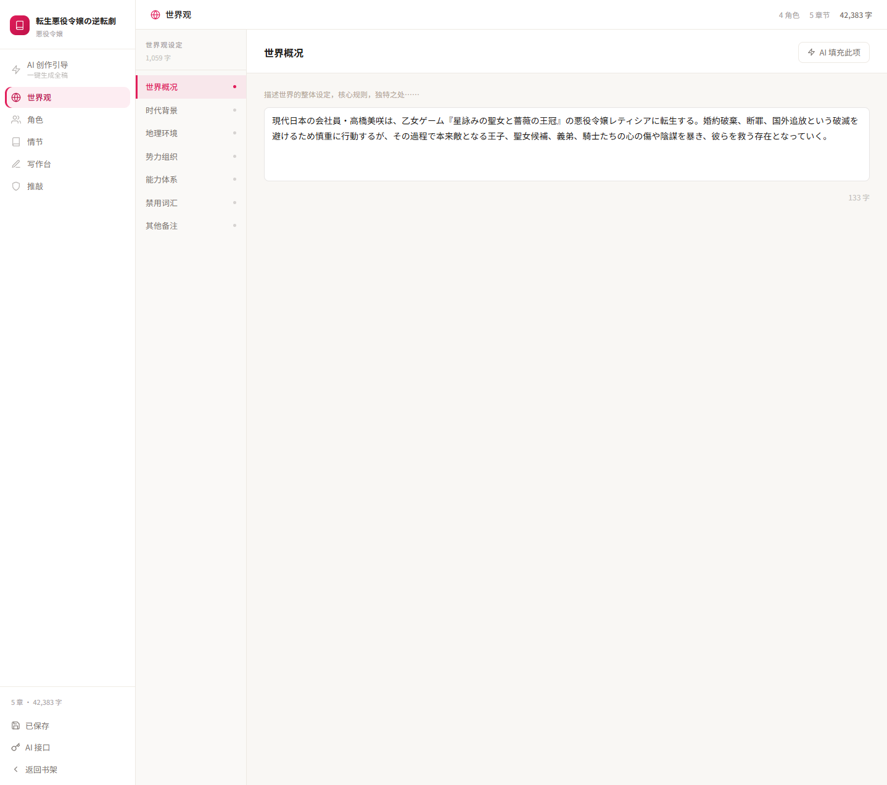
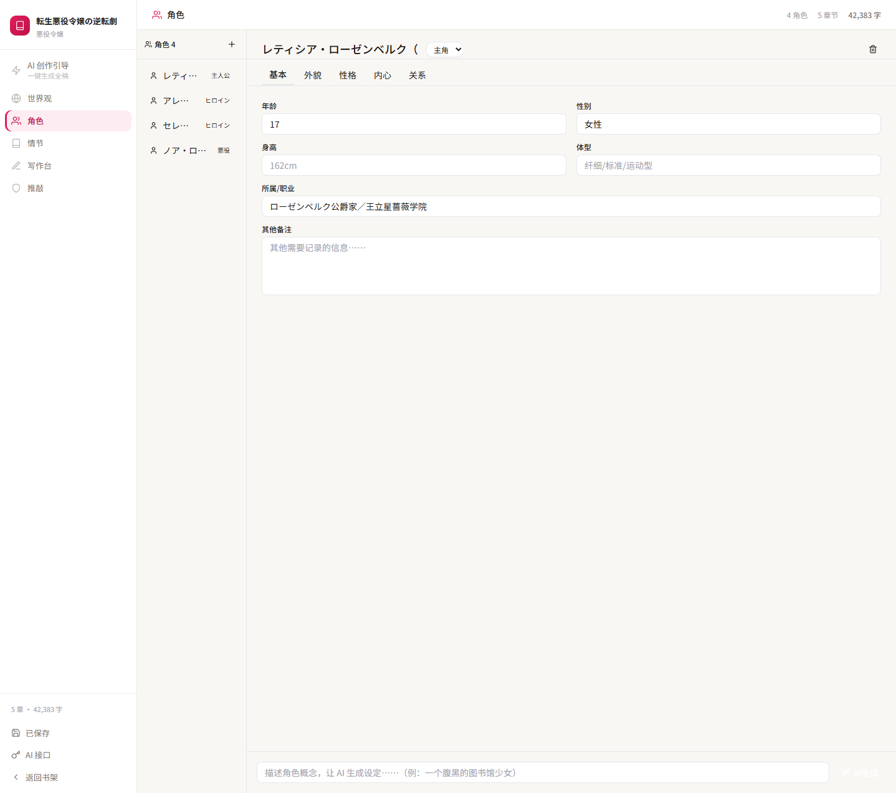
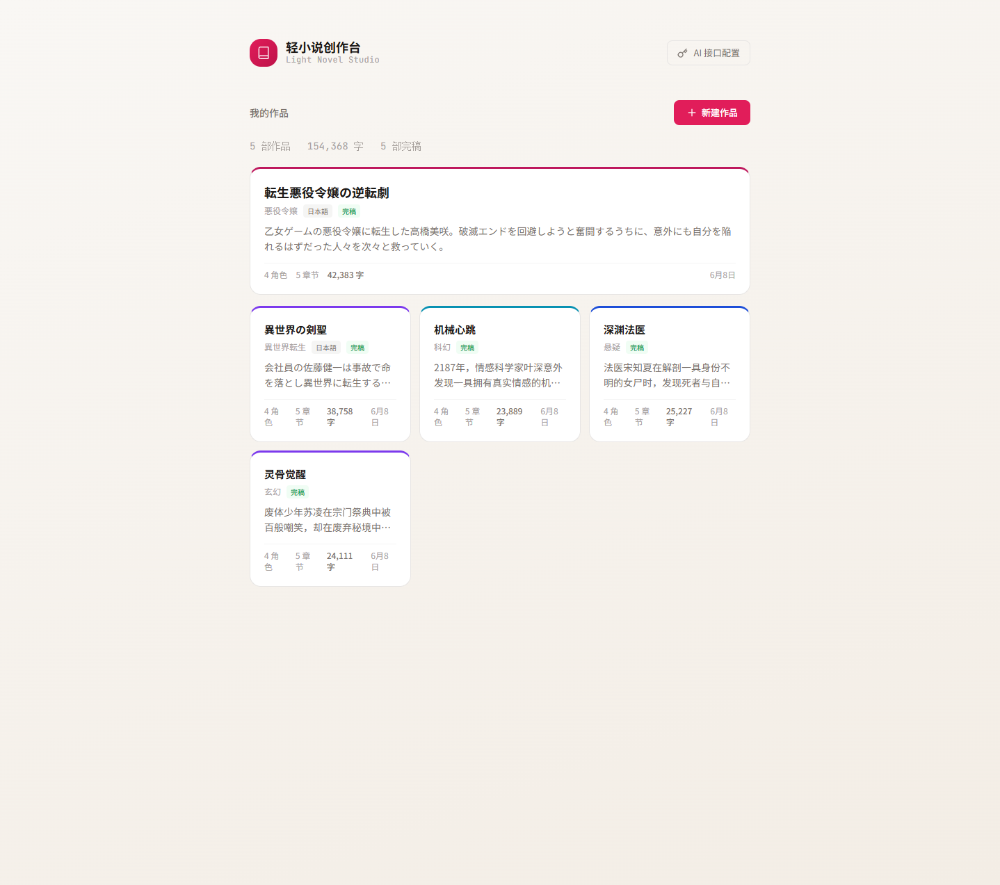

# Light Novel Studio · 轻小说创作台

English | [简体中文](README.md)

> From a single one-line concept, AI writes your entire light novel — worldbuilding → cast → chapter outline → full chapter text. Chinese or Japanese, your choice of AI provider, fully client-side. Your data stays in your browser.

---

## Screenshots

| Creation Wizard | Writing Desk |
|---|---|
|  |  |

| Worldbuilding | Characters |
|---|---|
|  |  |



---

## Features

- 🎯 **One line to a full draft** — type a single concept and AI generates the world, the cast, the chapter outline, then writes every chapter in full.
- 🌏 **Chinese & Japanese** — built-in Chinese genres (xianxia, romance, sci-fi, mystery, wuxia…) and Japanese light-novel genres (異世界転生 / 悪役令嬢 / 魔法学園 / ラブコメ…).
- 🤖 **Multiple AI providers** — Google Gemini / Anthropic Claude / OpenAI / any OpenAI-compatible endpoint (DeepSeek, Qwen, local Ollama, etc.).
- 📝 **Writing desk** — AI continuation / character dialogue / scene generation, with serif typography, paragraph indentation, and an immersive mode.
- 👤 **Character management** — appearance, public vs. private persona, motivation, character arc, relationships.
- 🌍 **Worldbuilding / outline / review** — full setting panels plus consistency and reader-experience review.
- 💾 **Local-first** — every project lives in your browser `localStorage`; nothing touches a server.

## Tech Stack

React 19 · Vite 6 · TypeScript · Tailwind (CDN). A pure front-end SPA with no backend — AI calls go directly from the browser to each provider's API.

## Getting Started

```bash
npm install
npm run dev
```

Open <http://localhost:3000>, click **"AI 接口配置" (AI Provider Setup)** in the top-right corner, paste your API key, and start writing.

Production build:

```bash
npm run build   # output to dist/
```

## Provider Setup

Pick a provider in the setup dialog and paste your key:

| Provider | Get a key | Example model |
|---|---|---|
| Google Gemini | aistudio.google.com/apikey | `gemini-3.5-flash` |
| Anthropic Claude | console.anthropic.com | `claude-sonnet-4-6` |
| OpenAI | platform.openai.com | `gpt-5.5` |
| Custom (OpenAI-compatible) | provide a Base URL | DeepSeek / Qwen / Ollama, etc. |

> Your key is stored only in your local browser and is never uploaded to any third party.

## Project Layout

```
src/
├── App.tsx           # Main app: bookshelf + editor shell
├── llm.ts            # Multi-provider AI call layer
├── generation.ts     # Novel generation (world / cast / outline / prose / continuation / review)
├── storage.ts        # localStorage persistence
├── types.ts          # Type definitions
└── components/        # Wizard / World / Characters / Plot / Writing / Review panels
```

## License

[GPL-3.0](LICENSE)
